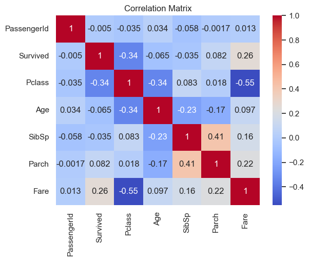
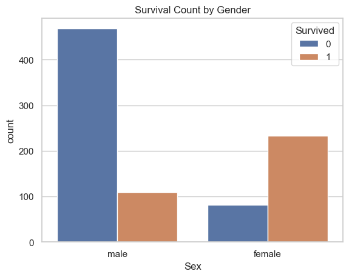
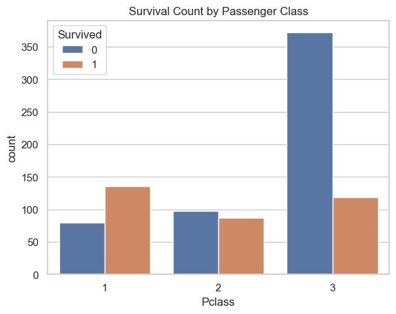
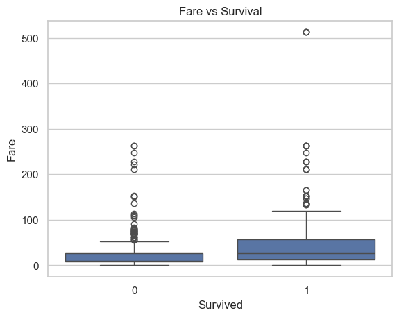

# 🚢 Titanic Dataset - Exploratory Data Analysis (EDA)

## 📌 Project Overview
This project performs Exploratory Data Analysis (EDA) on the Titanic dataset to understand patterns, relationships, and key factors affecting passenger survival.

---

## 🎯 Objective
- Understand dataset structure and features
- Handle missing values
- Perform statistical analysis
- Visualize data distributions and relationships
- Extract meaningful insights

---

## 🛠️ Tools & Technologies
- Python
- Pandas
- NumPy
- Matplotlib
- Seaborn
- Jupyter Notebook

---

## 📂 Project Structure

Titanic-EDA-Analysis/  
│── Titanic-Dataset.csv  
│── eda_analysis.ipynb  
│── README.md  
│── images/  
  ├── heatmap.png  
  ├── gender_survival.png  
  ├── class_survival.png  
  ├── fare_survival.png  

---

## 🔍 Steps Performed

### 1. Data Loading
- Loaded dataset using Pandas

### 2. Data Understanding
- Displayed dataset structure using `head()`, `info()`
- Checked missing values

### 3. Data Cleaning
- Filled missing values in `Age` using median
- Filled missing values in `Embarked` using mode
- Dropped `Cabin` column due to excessive missing values

### 4. Statistical Analysis
- Generated summary statistics using `describe()`
- Checked skewness of numerical features

### 5. Data Visualization
- Histograms for feature distributions
- Boxplots for outlier detection
- Correlation heatmap
- Pairplot for feature relationships
- Countplots for survival analysis

## 📸 Visualizations

### Correlation Matrix

### Survival by Gender

### Survival by Passenger Class

### Fare vs Survival

---

## 📊 Key Insights

- Female passengers had higher survival rates than males
- First-class passengers had better survival probability
- Fare is positively correlated with survival
- Fare distribution is highly skewed with outliers
- Age has weaker correlation with survival
- Missing values were handled to improve data quality

---

## 📈 Conclusion
EDA helped uncover important patterns and relationships in the dataset. These insights can be used for building effective machine learning models.

---

## 🚀 Future Work
- Feature engineering
- Model building (Logistic Regression, Random Forest)
- Model evaluation

---

## 👨‍💻 Author
Prasanna G
